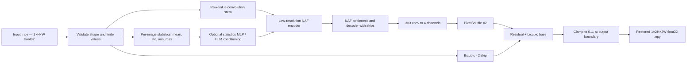

# Technical Design — Conditioned NAFNet-SR-Lite

## Overview

This specification defines a reproducible system for KLA PS01 that restores a grayscale `128×128` degraded NumPy array to a clean `256×256` float32 array. The same model path should accept any even `H×W` input and return `2H×2W`, covering a possible future `256×256 → 512×512` release.

The design deliberately separates the mandatory submission path from optional experiments. `evaluation.py`, the baseline model, data manifest, metrics, checkpoint format, and tests are mandatory. Degradation conditioning, auxiliary losses, ONNX, compilation, and test-time augmentation are optional and may enter the final model only after measured validation gains.

## Product epics

| Epic | Outcome |
|---|---|
| E1 — Data integrity | Pair and validate KLA arrays without clipping, leakage, or macOS metadata pollution |
| E2 — Joint restoration | Remove mixed noise and reconstruct 2× spatial detail with one model |
| E3 — Generalization | Measure and improve performance on held-out texture/source groups |
| E4 — Benchmarkability | Run directory-to-directory inference from a standalone top-level Python script |
| E5 — Evidence | Produce metrics, runtime, ablations, visual panels, and restored test outputs |
| E6 — Reproducibility | Rebuild the environment, training run, and checkpoint from public files |

## Stack

- Python 3.11 as the target interpreter; record the exact patch version used.
- PyTorch for model, training, AMP, and native inference.
- NumPy for official `.npy` I/O.
- scikit-image or TorchMetrics for PSNR/SSIM, locked to one implementation.
- official `lpips` package for LPIPS; repeat the grayscale channel three times only at metric time.
- PyYAML for experiment configuration.
- pytest for unit and CLI integration tests.
- TensorBoard or CSV/JSONL logs; use one, not both, if time is constrained.

Do not guess package pins in advance. Once the clean environment passes, generate the required `requirements.txt` from that exact environment and keep a short human-readable dependency table in the README.

## Architecture



### Primary model

Working name: `ConditionedNAFSR`.

1. **Stem:** `Conv2d(1, width, 3, padding=1)` on raw values. Do not normalize or clip in the dataset loader.
2. **Backbone:** three-scale NAFNet-style encoder/decoder with skip connections. Initial implementation target:
   - width: 48;
   - encoder blocks: `[2, 2, 4]`;
   - bottleneck blocks: `6`;
   - decoder blocks: `[2, 2, 2]`.
3. **Conditioning ablation:** encode `[mean, std, min, max]` with a two-layer MLP and provide per-stage feature scale/shift. Start with this branch disabled.
4. **SR head:** a `3×3` convolution to four channels followed by `PixelShuffle(2)`.
5. **Global skip:** add a bicubic-upsampled copy of the raw input. The network predicts a denoising/detail residual.
6. **Output:** return an unbounded tensor during training. Clamp to `[0,1]` only in metric and file-output code.

Parameter count and FLOPs must be measured after implementation. If the model exceeds 12M parameters or the FP32 state dictionary exceeds 60 MB, reduce width before adding features.

### Mandatory baselines

- `bicubic`: no learned parameters; provides the lower bound.
- `edsr_lite`: 16 residual blocks, width 64, one 2× pixel-shuffle head; provides a low-risk learned fallback.
- `naf_sr`: the primary backbone without statistics conditioning or extra losses.

Do not begin SwinIR/Restormer experiments until all three baselines have an end-to-end score and the standalone evaluator passes.

## Data design

### Expected source layout

```text
data/raw/train/
├── GT/                   # 000000.npy ... 003199.npy, 256×256 float32
└── NoisyLR/              # matching stems, 128×128 float32

data/raw/test/
└── NoisyLR/              # 400 degraded 128×128 float32 arrays
```

Raw data is ignored by Git. The repository stores only checksums/metadata, split manifests, small fixtures, and generated evidence.

### Discovery and validation rules

- discover only real `.npy` files under the configured directories;
- ignore any path segment named `__MACOSX` and any basename starting with `._`;
- pair by exact filename stem, never directory order;
- reject duplicate stems or a missing counterpart;
- load with `allow_pickle=False`;
- require 2D numeric arrays with finite values;
- convert to contiguous float32 without clipping;
- require target height and width to be exactly 2× input dimensions; and
- record shape, dtype, min, max, mean, standard deviation, and SHA-256 in the manifest-generation report.

### Split construction

Create `data/splits/manifest.csv` with columns:

`stem,input_relpath,target_relpath,source_group,texture_cluster,split,sha256_input,sha256_target`

Preferred split order:

1. use organizer-provided source groups if available;
2. otherwise compute deterministic texture descriptors from GT;
3. cluster descriptors with a fixed seed;
4. hold complete clusters out as `val_ood`;
5. sample `val_id` from the remaining clusters; and
6. keep the remainder as `train`.

Target proportions are roughly 70/15/15, but group integrity is more important than exact counts. Save the split algorithm, seed, and cluster summary.

### Training sample generation

Each batch chooses one of two paths:

- **Real paired path:** official NoisyLR and GT pair, with the same D4 spatial transform applied to both.
- **Synthetic path (disabled in run 0):** generate LR from GT using a fitted mixture of blur, downsample, additive Gaussian noise, and multiplicative speckle with randomized order.

Begin with 100% real pairs. Test 15% and 30% synthetic-batch probabilities as separate ablations. Never augment the public test set for checkpoint selection.

## Training design

### Phase A — fidelity baseline

- optimizer: AdamW;
- base learning rate: `2e-4`, tuned only if the calibration run is unstable;
- scheduler: cosine decay with short warm-up;
- precision: PyTorch AMP on CUDA, with loss scaling where needed;
- gradient clipping: global norm `1.0`;
- EMA: decay approximately `0.999`, validated against the raw model;
- crop: start with full `128×128 → 256×256` pairs; use aligned patches only if memory requires it;
- loss: Charbonnier only;
- save: last checkpoint plus the best validation composite checkpoint.

Run 200 timed steps first. Use the observed step time and validation cadence to set an epoch/step budget rather than assuming a training duration.

### Phase B — structure ablation

Candidate loss:

`L = L_charb + 0.15 L_ssim + 0.05 L_sobel + 0.01 L_fft`

Evaluate one cumulative change at a time. All loss computations compare float predictions with float GT; clamping is used for reported metrics, not to hide training instability.

### Phase C — OOD fine-tuning

Test, in order:

1. fitted degradation augmentation;
2. statistics conditioning;
3. a small LPIPS term; and
4. EMA checkpoint selection.

Retain a change only if it improves pseudo-OOD aggregate rank and does not cause an unacceptable ID regression. Define the acceptable regression before the run; recommended starting rule: no more than `0.15 dB` PSNR or `0.002` SSIM loss on validation-ID.

### Reproducibility controls

- seed Python, NumPy, PyTorch CPU, and CUDA RNGs;
- seed DataLoader workers and record the generator seed;
- save the resolved configuration and split-manifest hash with every run;
- record Git commit, Python, PyTorch, CUDA, cuDNN, GPU, and driver versions;
- provide a deterministic debug mode and a faster benchmark mode; and
- never promise bitwise equality across PyTorch releases or devices. PyTorch itself notes that full cross-release/platform reproducibility is not guaranteed.

## Metrics and model selection

### Official evidence metrics

- **PSNR:** higher is better; use `data_range=1.0` after output clamp.
- **SSIM:** higher is better; lock window size, Gaussian weighting, and implementation.
- **LPIPS:** lower is better; repeat grayscale to RGB and map `[0,1]` to `[-1,1]` exactly once.

### Diagnostic metrics

- Sobel-gradient L1;
- absolute mean-intensity bias;
- pre-clamp out-of-range pixel rate;
- per-texture-cluster performance;
- worst decile and 95% bootstrap confidence interval; and
- NaN/Inf and output-shape failure counts.

### Composite selection

Do not combine metrics with raw magnitudes. Rank candidate checkpoints separately by PSNR, SSIM, and LPIPS on `val_id` and `val_ood`, then average the six ranks with `val_ood` ties preferred. Store the full table so the choice is auditable.

## Standalone evaluation contract

The organizer identifies the evaluation script as the most important repository file. The top-level interface is:

```powershell
python evaluation.py <test_images_dir> <output_dir>
```

Optional flags may include:

```text
--weights weights/model.pt
--device auto|cpu|cuda
--precision fp32|bf16|auto
--batch-size 1
--report-json path/to/report.json
```

Required behavior:

- default checkpoint path is resolved relative to `evaluation.py`, not the caller's working directory;
- no source edit, Internet request, interactive prompt, notebook, or environment variable is required;
- traverse supported input files in sorted order and ignore macOS metadata;
- load `.npy` with `allow_pickle=False` and preserve float values outside `[0,1]` at input;
- validate each sample and report the offending path in any error;
- use `model.eval()` and `torch.inference_mode()`;
- write exactly one restored `.npy` for each input by default, preserving the filename stem;
- save float32 arrays of shape `2H×2W`, clipped to `[0,1]`;
- never write diagnostic files into the output directory unless an explicit report flag is supplied;
- print a concise count, device, checkpoint, elapsed time, and mean latency summary; and
- return a non-zero exit code on partial failure rather than silently skipping data.

### Precision and acceleration policy

Use native PyTorch FP32 as the initial default. Enable BF16-by-default on H100 only after a parity test demonstrates no material metric regression. ONNX, `torch.compile`, TTA, and ensembles are opt-in experiments; none may become the submission default unless clean-machine behavior and end-to-end runtime improve.

## Repository structure

```text
.
├── README.md                         # clone, install, inference, training, data, metrics, hardware
├── evaluation.py                     # MANDATORY standalone directory-to-directory evaluator
├── train.py                          # reproducible training entry point
├── evaluate_metrics.py               # labeled validation metrics; separate from judge inference
├── requirements.txt                  # exact frozen working environment required by I4C/KLA
├── requirements-dev.txt              # optional lint/test tools
├── pyproject.toml                    # optional formatter/test configuration, not a runtime requirement
├── LICENSE                           # code license; dataset remains governed by organizer terms
├── CITATION.cff                      # papers and this implementation
├── configs/
│   ├── baseline_edsr.yaml            # low-risk learned baseline
│   ├── naf_sr.yaml                   # unconditioned primary baseline
│   └── final.yaml                    # exact final experiment configuration
├── src/semirestore/
│   ├── __init__.py
│   ├── data.py                       # E1 pairing, validation, loading, transforms
│   ├── splits.py                     # E1/E3 manifest and texture/source holdouts
│   ├── degradations.py               # E3 fitted synthetic degradation pipeline
│   ├── models/
│   │   ├── edsr_lite.py              # E2 fallback
│   │   ├── naf_blocks.py             # E2 reusable NAF blocks
│   │   └── conditioned_naf_sr.py     # E2/E3 primary model
│   ├── losses.py                     # E2 fidelity/structure losses
│   ├── metrics.py                    # E5 PSNR, SSIM, LPIPS, diagnostic metrics
│   ├── engine.py                     # E2/E6 train/validate/checkpoint loop
│   ├── inference.py                  # E4 shared batched inference implementation
│   └── utils.py                      # seeds, environment report, hashes, logging
├── data/
│   ├── README.md                     # official download and expected extraction layout
│   ├── splits/manifest.csv           # E1/E3 reproducible pair/split manifest
│   └── fixtures/                     # tiny synthetic arrays committed for tests only
├── weights/
│   ├── model.pt                      # E4 final loadable checkpoint, preferably <60 MB
│   ├── model.sha256                  # integrity check
│   └── MODEL_CARD.md                 # data, metrics, limits, license, hardware
├── restored_test_outputs/            # required actual outputs; 400 .npy files
├── reports/
│   ├── dataset_audit.json            # E1 counts, shapes, ranges, ignored files
│   ├── validation_metrics.csv        # E5 per-image scores
│   ├── ablations.csv                 # E5 controlled experiment table
│   ├── benchmark.json                # E5 latency, throughput, VRAM, model size
│   └── figures/                      # slide-ready panels and plots
├── notebooks/
│   └── 01_eda.ipynb                  # optional exploration only; never required for inference
├── scripts/
│   ├── build_manifest.py             # E1 validate/pair/split data
│   ├── generate_test_outputs.py      # E4 wrapper using final model
│   ├── benchmark.py                  # E5 synchronized warm-up and latency benchmark
│   └── verify_submission.py          # E4/E6 repository compliance smoke test
├── tests/
│   ├── test_data.py
│   ├── test_model.py
│   ├── test_metrics.py
│   └── test_evaluation_cli.py
├── docs/
│   └── hackathon-build/              # feasibility, design, roadmap, and decision log
├── .github/workflows/ci.yml          # CPU smoke tests on clean checkout
└── .gitignore                        # raw data, runs, caches, local envs, non-final checkpoints
```

## Components and responsibilities

### Dataset and manifest layer

Implements E1 and E3. It owns pairing, shape/range validation, metadata filtering, source/texture groups, and immutable split assignment. Training code must never invent a split independently.

### Restoration model

Implements E2 and E3. It owns only tensor-to-tensor prediction. File I/O, clipping, and checkpoint path resolution live outside the model.

### Training engine

Implements E2 and E6. It owns optimization, AMP, validation cadence, EMA, checkpoint metadata, and run records. A checkpoint contains model weights, architecture configuration, training step, and normalization policy—never raw datasets.

### Metric evaluator

Implements E5. It consumes labeled predictions and targets and produces per-image plus aggregate scores with the exact preprocessing policy recorded.

### Standalone inference path

Implements E4. `evaluation.py` is deliberately thin and imports tested functions from `src/semirestore/inference.py`; packaging the code under `src/` must not require `pip install -e .` for the documented root-level command.

### Evidence and submission verifier

Implements E5 and E6. It checks that required files exist, checkpoint hashes match, output count matches input count, the README command succeeds, and no required path points outside the repository.

## Data flow

1. Extract organizer archives outside version control.
2. `build_manifest.py` ignores metadata, validates every real array, pairs stems, creates groups/splits, and writes the manifest plus audit.
3. `train.py --config configs/naf_sr.yaml` loads only manifest-assigned training rows and writes a self-describing run directory.
4. At validation, predictions are clamped consistently, scored per image, aggregated by ID/OOD/cluster, and checkpoint rank is updated.
5. The chosen checkpoint is copied to `weights/model.pt`, hashed, and loaded by a fresh process.
6. `evaluation.py` restores a directory to an empty output directory.
7. Validation evidence and the 400 test outputs are copied to their required repository folders.
8. `verify_submission.py` runs the same README commands in a clean environment and emits a pass/fail report.

## Error strategy

The three most damaging demo/judging failures are:

1. **Wrong current working directory:** resolve model and package paths from `__file__` and test execution from a different directory.
2. **Archive metadata treated as samples:** centralize discovery filters and assert exact real sample counts when using the current release.
3. **Checkpoint/config drift:** embed the resolved architecture configuration in the checkpoint, verify a SHA-256, and construct the model from checkpoint metadata.

Also fail fast on non-finite input, wrong dimensionality, missing weights, unsupported suffix, an existing non-empty output directory unless `--overwrite` is explicit, and any output count mismatch.

## Verification plan

### Unit tests

- pairing by stem and duplicate/missing-pair rejection;
- filtering of `__MACOSX` and `._*` entries;
- input range preserved before the model;
- paired D4 transform alignment;
- model output shape for `128×128` and `256×256` inputs;
- finite forward/backward pass;
- PSNR/SSIM/LPIPS preprocessing on known fixtures; and
- checkpoint round-trip and relative-path resolution.

### Integration tests

- overfit eight samples to prove the data/model/loss path;
- one-epoch CPU smoke training on fixtures;
- root-level `evaluation.py` run from a foreign working directory;
- a directory containing real files plus macOS metadata;
- empty, corrupt, non-finite, and wrong-shape inputs;
- output count, stem, dtype, shape, range, and deterministic ordering; and
- a clean virtual environment install and inference run.

### Quality tests

- bicubic, EDSR-lite, and NAF-SR on identical split and metric code;
- ID versus pseudo-OOD score table;
- one-variable-at-a-time ablations;
- worst-decile visual review for oversmoothing, ringing, checkerboards, and invented lines; and
- intensity-binned metrics because input mean/std vary substantially.

### Performance tests

- batch size 1, then optional throughput batches;
- 20 warm-up iterations and at least 100 timed iterations;
- `torch.cuda.synchronize()` around measured GPU work;
- report model-only latency and end-to-end file I/O separately;
- median, p90, and p95 latency, peak VRAM, parameter count, checkpoint size, and output rate; and
- never label local-GPU timing as H100 timing.

## Demo and submission flow

The safest demonstration is under three minutes even though the general page allows five:

1. show one degraded `.npy` and its intensity range outside `[0,1]`;
2. run the exact README evaluator command;
3. show generated output count and runtime;
4. show degraded/bicubic/restored/GT crops for an ID success and an OOD or hard case;
5. show the PSNR/SSIM/LPIPS and ablation table; and
6. close with model size, default latency, and honest limitations.

### Slide mapping

Use nine content slides after removing the instruction slide:

1. Team details.
2. Problem and semiconductor impact.
3. Idea: conservative joint restoration and why one model handles all degradations.
4. Architecture, data flow, training stages, losses, and augmentation.
5. Innovation: OOD split, raw-range handling, optional conditioning, speed/fidelity design.
6. Results: PSNR/SSIM/LPIPS, bicubic/EDSR/NAF ablation, images, failure case.
7. Technology and feasibility: stack, hardware, training time, model/checkpoint size, latency.
8. Public GitHub and ≤5-minute video links.
9. References.

## Research basis

- Liangyu Chen et al., [Simple Baselines for Image Restoration (NAFNet), ECCV 2022](https://arxiv.org/abs/2204.04676).
- Bee Lim et al., [Enhanced Deep Residual Networks for Single Image Super-Resolution, CVPR Workshops 2017](https://arxiv.org/abs/1707.02921).
- Jingyun Liang et al., [SwinIR: Image Restoration Using Swin Transformer, ICCV Workshops 2021](https://arxiv.org/abs/2108.10257).
- Syed Waqas Zamir et al., [Restormer: Efficient Transformer for High-Resolution Image Restoration, CVPR 2022](https://openaccess.thecvf.com/content/CVPR2022/html/Zamir_Restormer_Efficient_Transformer_for_High-Resolution_Image_Restoration_CVPR_2022_paper.html).
- Richard Zhang et al., [The Unreasonable Effectiveness of Deep Features as a Perceptual Metric (LPIPS), CVPR 2018](https://openaccess.thecvf.com/content_cvpr_2018/CameraReady/0299.pdf).
- [PyTorch reproducibility guidance](https://docs.pytorch.org/docs/stable/notes/randomness).
- [PyTorch automatic mixed precision guidance](https://docs.pytorch.org/docs/stable/amp.html).
- [PyTorch ONNX exporter guidance](https://docs.pytorch.org/docs/stable/onnx.html) for the optional deployment experiment.
